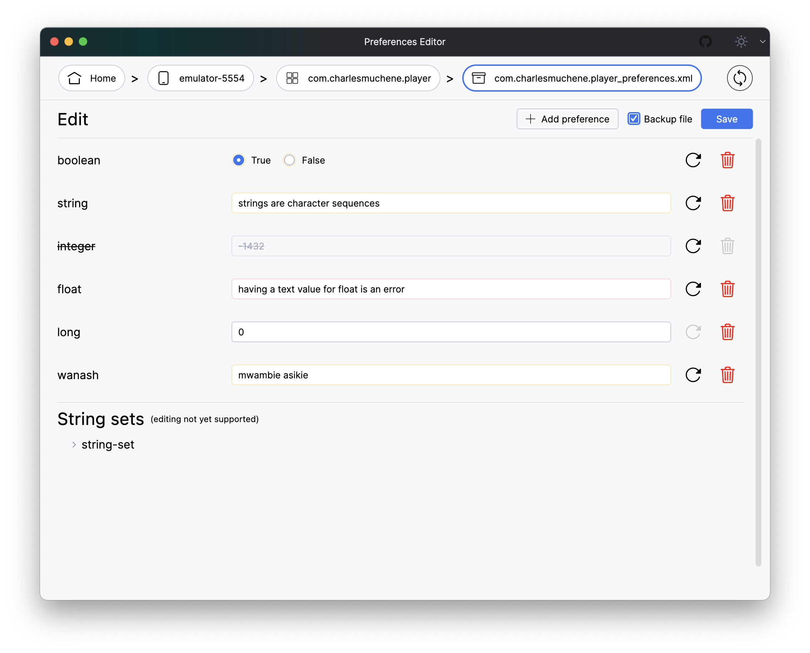

# Preferences Editor
A desktop app to edit on-device shared preferences.

# Usage
> Ensure `adb` is available on your `PATH`.

A local installation of ADB is required. It should be included in the Android SDK Platform Tools package downloaded while setting up Android Studio.
If not, download the package with the SDK Manager or get the standalone tools from [here](https://developer.android.com/studio/releases/platform-tools).

From the main window:
* Select device
* Choose your app
* Select preferences file
* View/Edit preferences
* Star any item to find it faster next time

| Device Listing                                | Editing Preferences                        |
|-----------------------------------------------|--------------------------------------------|
|  |  |

And we go dark too 😎

| Preferences Files Listing                   | Filtering is supported                         |
|---------------------------------------------|------------------------------------------------|
|  |  |

# Installation

// TBD

# License

    Copyright (c) 2024 Charles Muchene
    
    Licensed under the Apache License, Version 2.0 (the "License");
    you may not use this file except in compliance with the License.
    You may obtain a copy of the License at
    
        http://www.apache.org/licenses/LICENSE-2.0
    
    Unless required by applicable law or agreed to in writing, software
    distributed under the License is distributed on an "AS IS" BASIS,
    WITHOUT WARRANTIES OR CONDITIONS OF ANY KIND, either express or implied.
    See the License for the specific language governing permissions and
    limitations under the License.
